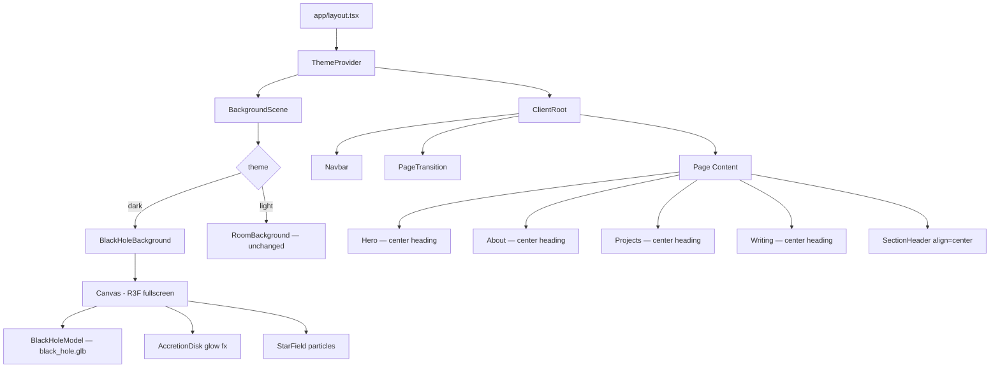
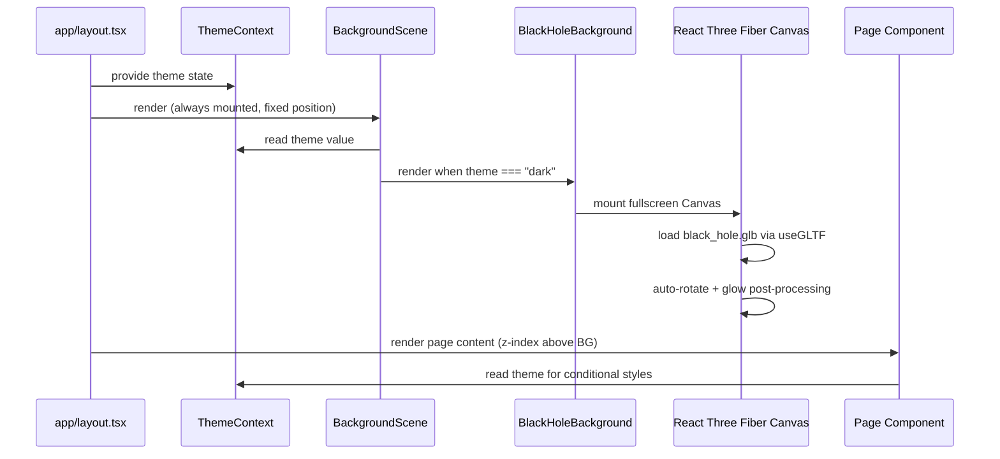
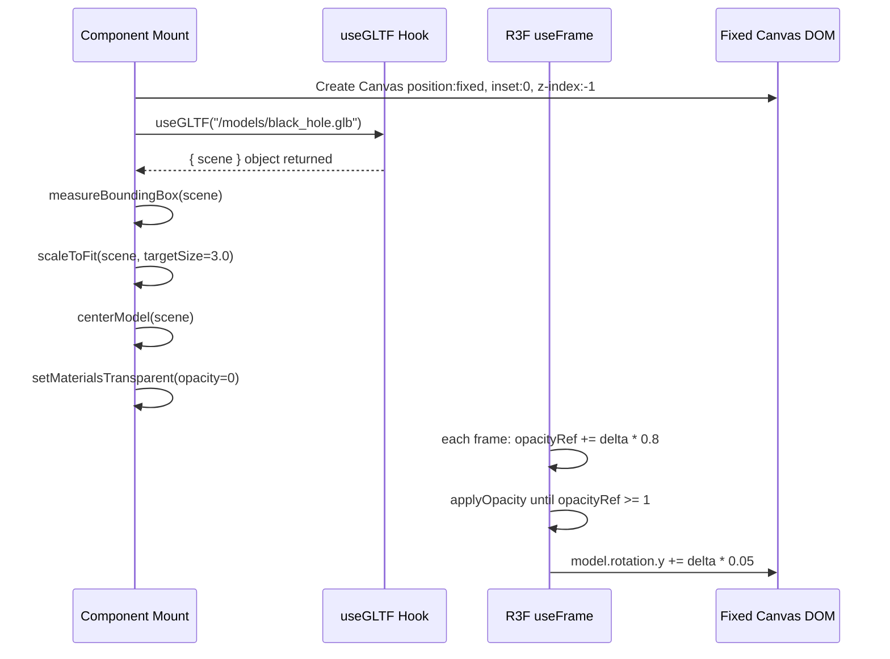

# Design Document: Black Hole Visual Theme

## Overview

Transformasi visual penuh portfolio website dari tema space aurora biru/ungu menjadi estetika black hole — hitam pekat dengan cincin cahaya emas/golden (terinspirasi Gargantua dari film Interstellar). Perubahan mencakup: penggantian model 3D background dengan `black_hole.glb`, pembaruan color palette dark mode ke hitam pekat + golden amber, penataan ulang semua heading menjadi center-aligned, serta refactor arsitektur rendering agar black hole menjadi fullscreen background scene di seluruh halaman.

Stack: Next.js 14, TypeScript, React Three Fiber (r3f), @react-three/drei, GSAP, Tailwind CSS v4.

---

## Architecture

### High-Level Component Diagram



### Data Flow Diagram



---

## Components and Interfaces

### Component 1: BlackHoleBackground

**File**: `components/BlackHoleBackground.tsx` (file baru, menggantikan peran SpaceBackground.tsx di dark mode)

**Purpose**: Merender model `black_hole.glb` sebagai fullscreen fixed-position background canvas menggunakan React Three Fiber. Menggantikan `SpaceBackground` CSS-only di dark mode.

**Interface**:
```typescript
interface BlackHoleBackgroundProps {
  // No props — membaca theme dari context secara internal jika diperlukan
}

export default function BlackHoleBackground(): JSX.Element
```

**Responsibilities**:
- Mount R3F `<Canvas>` dengan `style={{ position: "fixed", inset: 0, zIndex: -1 }}`
- Load `black_hole.glb` via `useGLTF("/models/black_hole.glb")`
- Auto-scale model agar mengisi ~70–80% viewport height
- Auto-rotate lambat (autoRotateSpeed ≈ 0.3)
- Render ambient + point lights berwarna golden/amber
- Tidak menerima pointer events (`pointerEvents: "none"`)


### Component 2: BackgroundScene (diupdate)

**File**: `components/BackgroundScene.tsx`

**Purpose**: Orchestrator background — switch antara BlackHoleBackground (dark) dan RoomBackground (light).

**Interface**:
```typescript
// Tidak ada perubahan pada interface publik
export default function BackgroundScene(): JSX.Element
```

**Perubahan dari kode saat ini**:
- Hapus `import PlanetModel` (model planet tidak dipakai di background global lagi)
- Hapus blok `<div className="model-bg-canvas"><PlanetModel /></div>`
- Ganti `import SpaceBackground` → `import BlackHoleBackground`
- Kondisi dark: render `<BlackHoleBackground />` instead of `<SpaceBackground />`

**Kode baru**:
```typescript
"use client";
import { useTheme } from "./ThemeContext";
import BlackHoleBackground from "./BlackHoleBackground";
import RoomBackground from "./RoomBackground";

export default function BackgroundScene() {
  const { theme } = useTheme();
  return theme === "dark" ? <BlackHoleBackground /> : <RoomBackground />;
}
```

### Component 3: PlanetModel → BlackHoleModel (refactor)

**File**: `components/PlanetModel.tsx` (diupdate in-place)

**Purpose**: Model 3D yang muncul di Hero section sebelah kanan (desktop). Sekarang load `black_hole.glb` alih-alih `hantavirus.glb`.

**Perubahan**:
- `MODEL_PATH` diubah dari `/models/hantavirus.glb` → `/models/black_hole.glb`
- Lighting dirombak: warna golden/amber alih-alih biru
- `Environment preset` dark: dari `"night"` → `"night"` (tetap), namun `toneMappingExposure` dinaikkan ke 1.2 agar glow emas terlihat
- `autoRotateSpeed` diturunkan dari 0.8 → 0.4 untuk kesan dramatis

**Interface** — tidak berubah:
```typescript
interface PlanetModelProps {
  theme: "light" | "dark";
}
export default function PlanetModel({ theme }: PlanetModelProps): JSX.Element
```

### Component 4: SectionHeader (diupdate)

**File**: `components/SectionHeader.tsx`

**Purpose**: Header section reusable. Default `align` diubah dari `"left"` ke `"center"`.

**Perubahan**:
```typescript
// SEBELUM
align = "left"

// SESUDAH  
align = "center"
```

**Catatan**: Ini berdampak ke semua halaman yang menggunakan `SectionHeader` (About, Projects, Writing). Hero heading diatur terpisah di `Hero.tsx`.

### Component 5: Hero (diupdate)

**File**: `components/Hero.tsx`

**Purpose**: Halaman home/hero. Semua heading dan konten kiri di-center di semua viewport, bukan hanya mobile.

**Perubahan alignment**:
```typescript
// SEBELUM — leftColRef div className:
"flex flex-col justify-center min-h-screen w-full md:w-[52%]
 px-6 md:pl-20 md:pr-8 pt-28 md:pt-0 text-center md:text-left"

// SESUDAH — fullwidth, selalu center:
"flex flex-col justify-center items-center min-h-screen
 w-full px-6 md:px-20 pt-28 md:pt-0 text-center"
```

Elemen yang diubah dari `justify-start` / `justify-center md:justify-start` → selalu `justify-center`:
- `badgeRef` div: `flex justify-center`
- `socialsRef` div: `flex justify-center`
- `btnsRef` div: `flex flex-wrap items-center justify-center`
- `statsRef` div: `flex justify-center`
- `scrollRef` — sudah `left-1/2 -translate-x-1/2`, tidak perlu diubah


### Component 6: Navbar (diupdate)

**File**: `components/Navbar.tsx`

**Purpose**: Mengubah warna background navbar dark mode dari biru-gelap ke hitam pekat.

**Perubahan**:
```typescript
// SEBELUM
const navBgScrolled = isDark
  ? "bg-[rgba(8,14,35,0.85)] shadow-[...]"
  : ...

const navBgDefault = isDark
  ? "bg-[rgba(10,18,45,0.65)] shadow-[...]"
  : ...

// SESUDAH — hitam murni, tanpa tint biru
const navBgScrolled = isDark
  ? "bg-[rgba(0,0,0,0.88)] shadow-[0_8px_32px_rgba(0,0,0,0.8),0_0_0_1px_rgba(251,191,36,0.12)]"
  : ...

const navBgDefault = isDark
  ? "bg-[rgba(0,0,0,0.65)] shadow-[0_4px_24px_rgba(0,0,0,0.6),0_0_0_1px_rgba(251,191,36,0.08)]"
  : ...
```

Border glow berubah dari `rgba(255,255,255,0.07)` menjadi `rgba(251,191,36,0.12)` (golden subtle).

### Component 7: ThemeToggle (diupdate)

**File**: `components/ThemeToggle.tsx`

**Purpose**: Ikon Sun/Moon toggle. Warna ikon dark mode diubah dari `text-blue-200` ke golden.

**Perubahan**:
```typescript
// SEBELUM
"border border-white/10 bg-white/5 hover:bg-white/12 text-blue-200"

// SESUDAH
"border border-amber-400/20 bg-white/5 hover:bg-amber-400/10 text-amber-300"
```

---

## Data Models

### Color Token Map (Dark Mode — sebelum vs sesudah)

```typescript
// globals.css :root — dark mode tokens
interface DarkThemeTokens {
  "--background": string;   // #000005 → #000000
  "--foreground": string;   // #e8f4ff → #f5f0e8  (warm white)
  "--accent": string;       // #3b82f6 → #F59E0B  (amber-500)
  "--accent-glow": string;  // rgba(59,130,246,0.35) → rgba(245,158,11,0.35)
}
```

### CSS Variable Changes

| Variable | Nilai Lama | Nilai Baru |
|---|---|---|
| `--background` | `#000005` | `#000000` |
| `--foreground` | `#e8f4ff` | `#f5f0e8` |
| `--accent` | `#3b82f6` | `#F59E0B` |
| `--accent-glow` | `rgba(59,130,246,0.35)` | `rgba(245,158,11,0.35)` |

### Golden Color Palette

```typescript
const GOLDEN_PALETTE = {
  primary:   "#F59E0B",  // amber-500 — accent utama
  bright:    "#FBBF24",  // amber-400 — highlight, glow
  deep:      "#D97706",  // amber-600 — border, subtle
  warm:      "#FFB300",  // golden — special emphasis
  muted:     "#92400E",  // amber-800 — very subtle bg tint
  textMuted: "#FDE68A",  // amber-200 — body text di dark
} as const;
```

---

## Main Algorithm/Workflow — BlackHoleBackground Rendering




---

## Key Functions with Formal Specifications

### Function 1: scaleModelToFit()

```typescript
function scaleModelToFit(
  group: THREE.Group,
  targetDimension: number
): void
```

**Preconditions:**
- `group` adalah Three.js Group yang sudah ter-attach ke scene
- `group` memiliki setidaknya satu child mesh
- `targetDimension > 0`

**Postconditions:**
- `group.scale` di-set sehingga `maxDim(boundingBox) === targetDimension`
- `group.position` di-set ke negasi center bounding box (centered at origin)
- Tidak ada mutasi pada material atau geometry

**Loop Invariants:** N/A (tidak ada loop)

### Function 2: fadeInModel()

```typescript
// Dipanggil setiap frame via useFrame hook
function fadeInModel(
  delta: number,
  opacityRef: React.MutableRefObject<number>,
  groupRef: React.MutableRefObject<THREE.Group | null>
): void
```

**Preconditions:**
- `delta` adalah frame time dalam detik (> 0)
- `opacityRef.current` dimulai dari 0.0
- Semua material pada `groupRef.current` sudah di-set `transparent = true`

**Postconditions:**
- `opacityRef.current` bertambah sebesar `delta * FADE_SPEED` setiap frame
- `opacityRef.current` tidak pernah melebihi 1.0 (di-clamp)
- Semua material mesh dalam group memiliki `opacity === opacityRef.current`
- Saat `opacityRef.current >= 1`, fungsi tidak lagi memodifikasi material (early return)

**Loop Invariants:**
- Setiap frame: `newOpacity = Math.min(1, prevOpacity + delta * FADE_SPEED)`
- Semua mesh dalam group selalu memiliki opacity yang sama pada setiap frame

### Function 3: updateDarkThemeTokens()

Ini adalah perubahan statis di CSS, bukan fungsi runtime. Spesifikasi formal:

```typescript
// Precondition: :root CSS variables terdefinisi
// Postcondition: semua komponen yang bergantung pada CSS var() akan
// merender dengan warna baru tanpa perlu perubahan TSX

const DARK_TOKEN_UPDATES = {
  "--background":   { from: "#000005",                  to: "#000000"                  },
  "--foreground":   { from: "#e8f4ff",                  to: "#f5f0e8"                  },
  "--accent":       { from: "#3b82f6",                  to: "#F59E0B"                  },
  "--accent-glow":  { from: "rgba(59,130,246,0.35)",    to: "rgba(245,158,11,0.35)"    },
} as const;
```

---

## Algorithmic Pseudocode

### BlackHoleModel Component — Full Algorithm

```pascal
COMPONENT BlackHoleSceneModel(isDark: boolean)
  
  DECLARE scene ← useGLTF("/models/black_hole.glb").scene
  DECLARE groupRef ← useRef<THREE.Group>(null)
  DECLARE opacityRef ← useRef<number>(0)
  DECLARE readyRef ← useRef<boolean>(false)

  ON_MOUNT (useEffect, depends: [scene])
    IF groupRef.current IS NULL THEN RETURN END IF

    // Step 1: Measure bounding box
    box ← new THREE.Box3().setFromObject(groupRef.current)
    center ← box.getCenter(new THREE.Vector3())
    size ← box.getSize(new THREE.Vector3())
    maxDim ← MAX(size.x, size.y, size.z)
    
    // Step 2: Center at origin
    groupRef.current.position.set(-center.x, -center.y, -center.z)
    
    // Step 3: Scale to fit
    IF maxDim > 0 THEN
      scaleFactor ← TARGET_DIM / maxDim  // TARGET_DIM = 3.0 for background
      groupRef.current.scale.setScalar(scaleFactor)
    END IF
    
    // Step 4: Set all materials to transparent for fade-in
    FOR EACH child IN groupRef.current.traverse() DO
      IF child.isMesh THEN
        FOR EACH mat IN child.material DO
          mat.transparent ← true
          mat.opacity ← 0
          mat.needsUpdate ← true
        END FOR
      END IF
    END FOR
    
    readyRef.current ← true
  END ON_MOUNT

  ON_FRAME (useFrame, delta: number)
    IF NOT readyRef.current OR groupRef.current IS NULL THEN RETURN END IF
    
    // Fade in
    IF opacityRef.current < 1 THEN
      opacityRef.current ← MIN(1, opacityRef.current + delta * 0.8)
      FOR EACH mesh IN groupRef.current.traverse() DO
        IF mesh.isMesh THEN
          mesh.material.opacity ← opacityRef.current
        END IF
      END FOR
    END IF
    
    // Slow rotation — dramatic black hole effect
    groupRef.current.rotation.y ← groupRef.current.rotation.y + delta * 0.05
  END ON_FRAME

  RETURN (
    <group ref={groupRef}>
      <primitive object={scene} />
    </group>
  )
END COMPONENT
```


### CSS Update Algorithm — globals.css

```pascal
PROCEDURE updateBlackHoleTheme()

  // 1. Root dark tokens
  REPLACE ":root --background"  "#000005"  WITH  "#000000"
  REPLACE ":root --foreground"  "#e8f4ff"  WITH  "#f5f0e8"
  REPLACE ":root --accent"      "#3b82f6"  WITH  "#F59E0B"
  REPLACE ":root --accent-glow" "rgba(59,130,246,0.35)" WITH "rgba(245,158,11,0.35)"

  // 2. Hapus .space-bg, .space-bg__* classes (digantikan oleh R3F Canvas)
  REMOVE  ".space-bg and all sub-selectors"

  // 3. Update .section-label — biru → golden
  REPLACE "color: rgba(147,197,253,0.7)"    WITH "color: rgba(251,191,36,0.75)"
  REPLACE "border: 1px solid rgba(59,130,246,0.25)" WITH "border: 1px solid rgba(245,158,11,0.25)"
  REPLACE "background: rgba(59,130,246,0.08)" WITH "background: rgba(245,158,11,0.08)"

  // 4. Update .section-title gradient — biru → golden
  REPLACE "linear-gradient(135deg, #ffffff 0%, #bfdbfe 50%, #60a5fa 100%)"
    WITH   "linear-gradient(135deg, #ffffff 0%, #FDE68A 50%, #F59E0B 100%)"
  REPLACE "drop-shadow(0 0 20px rgba(59,130,246,0.3))"
    WITH   "drop-shadow(0 0 20px rgba(245,158,11,0.3))"

  // 5. Update .btn-primary — biru → golden
  REPLACE "linear-gradient(135deg, #2563eb, #3b82f6)" 
    WITH   "linear-gradient(135deg, #D97706, #F59E0B)"
  REPLACE "border: 1px solid rgba(96,165,250,0.4)"
    WITH   "border: 1px solid rgba(251,191,36,0.4)"
  REPLACE "box-shadow: 0 0 24px rgba(59,130,246,0.3)"
    WITH   "box-shadow: 0 0 24px rgba(245,158,11,0.3)"

  // 6. Update .hero-heading--dark — biru → golden
  REPLACE "linear-gradient(135deg, #ffffff 0%, #bfdbfe 50%, #60a5fa 100%)"
    WITH   "linear-gradient(135deg, #ffffff 0%, #FDE68A 55%, #F59E0B 100%)"
  REPLACE "drop-shadow(0 0 30px rgba(59,130,246,0.35))"
    WITH   "drop-shadow(0 0 30px rgba(245,158,11,0.4))"

  // 7. Update .timeline-item dots — biru → golden
  REPLACE "background: linear-gradient(135deg, #3b82f6, #60a5fa)"
    WITH   "background: linear-gradient(135deg, #D97706, #F59E0B)"
  REPLACE "box-shadow: 0 0 12px rgba(59,130,246,0.6)"
    WITH   "box-shadow: 0 0 12px rgba(245,158,11,0.6)"

  // 8. Update .description-muted dark
  REPLACE "color: rgba(147,197,253,0.65)"
    WITH   "color: rgba(253,230,138,0.65)"  // amber-200/65

  // 9. Update scrollbar dark
  REPLACE "::-webkit-scrollbar-track background: #000005"
    WITH   "::-webkit-scrollbar-track background: #000000"

  // 10. Update card-float hover glow
  REPLACE "0 0 50px rgba(59,130,246,0.1)"
    WITH   "0 0 50px rgba(245,158,11,0.12)"

END PROCEDURE
```

---

## Example Usage

### BlackHoleBackground — Full Component Code

```typescript
"use client";

import { Canvas, useFrame } from "@react-three/fiber";
import { OrbitControls, useGLTF, Environment } from "@react-three/drei";
import { Suspense, useEffect, useRef } from "react";
import * as THREE from "three";

const MODEL_PATH = "/models/black_hole.glb";
const TARGET_DIM = 3.0;
const FADE_SPEED = 0.8;
const ROTATE_SPEED = 0.05;

function BlackHoleSceneModel() {
  const { scene } = useGLTF(MODEL_PATH);
  const groupRef = useRef<THREE.Group>(null);
  const opacityRef = useRef(0);
  const readyRef = useRef(false);

  useEffect(() => {
    if (!groupRef.current) return;
    const box = new THREE.Box3().setFromObject(groupRef.current);
    const center = new THREE.Vector3();
    const size = new THREE.Vector3();
    box.getCenter(center);
    box.getSize(size);
    groupRef.current.position.set(-center.x, -center.y, -center.z);
    const maxDim = Math.max(size.x, size.y, size.z);
    if (maxDim > 0) groupRef.current.scale.setScalar(TARGET_DIM / maxDim);
    groupRef.current.traverse((child) => {
      if ((child as THREE.Mesh).isMesh) {
        const mat = (child as THREE.Mesh).material as THREE.Material;
        mat.transparent = true; mat.opacity = 0; mat.needsUpdate = true;
      }
    });
    readyRef.current = true;
  }, [scene]);

  useFrame((_, delta) => {
    if (!readyRef.current || !groupRef.current) return;
    if (opacityRef.current < 1) {
      opacityRef.current = Math.min(1, opacityRef.current + delta * FADE_SPEED);
      groupRef.current.traverse((child) => {
        if ((child as THREE.Mesh).isMesh)
          ((child as THREE.Mesh).material as THREE.Material).opacity = opacityRef.current;
      });
    }
    groupRef.current.rotation.y += delta * ROTATE_SPEED;
  });

  return <group ref={groupRef}><primitive object={scene} /></group>;
}

useGLTF.preload(MODEL_PATH);

export default function BlackHoleBackground() {
  return (
    <div
      style={{
        position: "fixed", inset: 0, zIndex: -1,
        pointerEvents: "none", overflow: "hidden",
      }}
      aria-hidden
    >
      <Canvas
        camera={{ position: [0, 0, 8], fov: 45, near: 0.1, far: 300 }}
        gl={{
          toneMapping: THREE.ACESFilmicToneMapping,
          toneMappingExposure: 1.4,
          alpha: true,
        }}
        style={{ width: "100%", height: "100%" }}
      >
        <ambientLight intensity={0.05} />
        {/* Golden key light — simulates accretion disk glow */}
        <pointLight position={[0, 0, 4]} intensity={12} color="#FFB300" distance={30} decay={2} />
        <pointLight position={[4, 2, 2]} intensity={6} color="#F59E0B" distance={25} decay={2} />
        <pointLight position={[-4, -2, 2]} intensity={4} color="#D97706" distance={20} decay={2} />
        <directionalLight position={[0, 5, 5]} intensity={0.8} color="#FDE68A" />
        <Environment preset="night" />
        <Suspense fallback={null}>
          <BlackHoleSceneModel />
        </Suspense>
        <OrbitControls enableZoom={false} enablePan={false} enableRotate={false} />
      </Canvas>
    </div>
  );
}
```


### PlanetModel.tsx — Perubahan Spesifik

```typescript
// PERUBAHAN 1: MODEL_PATH
const MODEL_PATH = "/models/black_hole.glb"; // was: hantavirus.glb

// PERUBAHAN 2: toneMappingExposure
toneMappingExposure: isDark ? 1.2 : 0.85, // was: 0.65 : 0.85

// PERUBAHAN 3: Lighting — semua golden
<directionalLight
  position={[5, 8, 4]}
  intensity={isDark ? 2.5 : 2.5}
  color={isDark ? "#FFB300" : "#ffffff"} // was: "#fff5e0"
/>
<pointLight
  position={[3, 4, 2]}
  intensity={isDark ? 10 : 3}
  color={isDark ? "#F59E0B" : "#93c5fd"} // was: "#60a5fa"
  distance={20} decay={2}
/>
<pointLight
  position={[-3, -4, 2]}
  intensity={isDark ? 6 : 2}
  color={isDark ? "#D97706" : "#93c5fd"} // was: "#93c5fd"
  distance={20} decay={2}
/>

// PERUBAHAN 4: autoRotateSpeed
autoRotateSpeed={0.4} // was: 0.8

// PERUBAHAN 5: preload
useGLTF.preload("/models/black_hole.glb"); // was: MODEL_PATH yang lama
```

### Hero.tsx — Perubahan Alignment Spesifik

```typescript
// SEBELUM — leftColRef div
className="
  relative z-10 flex flex-col justify-center
  min-h-screen w-full md:w-[52%]
  px-6 md:pl-20 md:pr-8 pt-28 md:pt-0
  text-center md:text-left
"

// SESUDAH — fullwidth, center di semua viewport
className="
  relative z-10 flex flex-col justify-center items-center
  min-h-screen w-full
  px-6 md:px-16 pt-28 md:pt-0
  text-center
"

// SEBELUM — badge container
<div ref={badgeRef} className="flex justify-center md:justify-start mb-3">
// SESUDAH
<div ref={badgeRef} className="flex justify-center mb-3">

// SEBELUM — socials container
<div ref={socialsRef} className="flex justify-center md:justify-start gap-3 mb-4">
// SESUDAH
<div ref={socialsRef} className="flex justify-center gap-3 mb-4">

// SEBELUM — CTA buttons
<div ref={btnsRef} className="flex flex-wrap items-center justify-center md:justify-start gap-3">
// SESUDAH
<div ref={btnsRef} className="flex flex-wrap items-center justify-center gap-3">

// SEBELUM — stats
<div ref={statsRef} className="mt-6 flex justify-center md:justify-start">
// SESUDAH
<div ref={statsRef} className="mt-6 flex justify-center">

// PlanetModel di Hero — tetap di kanan (hiasan visual), tidak dihapus
// Namun ukurannya menyesuaikan dengan layout baru:
// Tetap absolute right, namun Hero content sekarang fullwidth + centered
```

### Hero.tsx — Warna Accent Heading & Subtext

```typescript
// hero-heading--dark class sudah diupdate di globals.css
// Tidak ada perubahan kode TSX untuk heading

// SEBELUM — subheading text color
className={`... ${theme === "dark" ? "text-blue-100/65" : "text-slate-600"}`}
// SESUDAH — warm golden muted
className={`... ${theme === "dark" ? "text-amber-100/65" : "text-slate-600"}`}

// SEBELUM — secondary subtext
className={`... ${theme === "dark" ? "text-blue-200/45" : "text-slate-400"}`}
// SESUDAH
className={`... ${theme === "dark" ? "text-amber-200/45" : "text-slate-400"}`}

// SEBELUM — scroll indicator
className={`... ${theme === "dark" ? "text-blue-200/30" : "..."}`}
// SESUDAH
className={`... ${theme === "dark" ? "text-amber-300/30" : "..."}`}

// SEBELUM — scroll line gradient
className={`... ${theme === "dark" ? "from-blue-400/50" : "..."} ...`}
// SESUDAH
className={`... ${theme === "dark" ? "from-amber-400/50" : "..."} ...`}
```

---

## Error Handling

### Scenario 1: black_hole.glb Tidak Ditemukan

**Kondisi**: File `public/models/black_hole.glb` tidak ada atau gagal di-load

**Response**:
- `useGLTF` akan throw error yang ditangkap oleh React `<Suspense>` boundary
- `BlackHoleBackground` menggunakan `<Suspense fallback={null}>` → background kosong (hitam) tetap terlihat berkat `--background: #000000`
- `PlanetModel` di Hero menggunakan `<Suspense fallback={<Html center>Loading…</Html>}>` → menampilkan loading text

**Recovery**:
- Halaman tetap dapat digunakan karena background CSS (`#000000`) masih aktif
- Log error ke console untuk debugging developer

### Scenario 2: WebGL Tidak Tersedia

**Kondisi**: Browser tidak mendukung WebGL (Canvas R3F gagal mount)

**Response**:
- R3F Canvas akan throw yang ditangkap Suspense/ErrorBoundary
- Background fallback otomatis ke CSS background `#000000`
- Konten halaman tetap terbaca karena layer z-index terpisah

**Recovery**:
- Tidak perlu recovery khusus — CSS background + konten halaman tetap berfungsi

### Scenario 3: Model Terlalu Besar / OutOfMemory

**Kondisi**: `black_hole.glb` terlalu besar untuk memory GPU (khususnya mobile)

**Response**:
- `toneMappingExposure` sudah di-set konservatif (1.4 untuk background, 1.2 untuk Hero widget)
- Model di-scale ke target dimensi tetap, tidak bergantung pada ukuran asli file

---

## Testing Strategy

### Unit Testing Approach

Test fokus pada logika non-visual yang dapat di-isolasi:

1. `scaleModelToFit` — berikan mock `THREE.Box3`, verifikasi `scale.x === targetDim / maxDim`
2. `fadeInModel` — simulasi multiple frames, verifikasi opacity monoton naik dan tidak melebihi 1.0
3. `SectionHeader` — render dengan `align` default baru (`"center"`), verifikasi class `text-center mx-auto` ada

### Property-Based Testing Approach

**Library**: `fast-check` (sudah tersedia di devDependencies)

**Properties yang dapat diuji**:

```typescript
// Property 1: scaleModelToFit — scale tidak pernah negatif atau NaN
fc.assert(fc.property(
  fc.float({ min: 0.1, max: 1000 }),  // maxDim
  fc.float({ min: 0.1, max: 10 }),    // targetDim
  (maxDim, targetDim) => {
    const scale = targetDim / maxDim;
    return scale > 0 && isFinite(scale);
  }
));

// Property 2: fadeInModel — opacity selalu dalam [0, 1]
fc.assert(fc.property(
  fc.float({ min: 0, max: 1 }),   // initial opacity
  fc.float({ min: 0.001, max: 0.1 }), // delta
  (initialOpacity, delta) => {
    const newOpacity = Math.min(1, initialOpacity + delta * 0.8);
    return newOpacity >= 0 && newOpacity <= 1;
  }
));
```

### Integration Testing Approach

- Visual regression test (manual): Screenshot dark mode sebelum/sesudah, pastikan warna golden terlihat
- Cross-browser WebGL test: Pastikan Canvas mount di Chrome, Firefox, Safari
- Lighthouse accessibility: Pastikan warna teks atas background hitam memenuhi WCAG AA (contrast ratio ≥ 4.5:1 untuk body text)

---

## Performance Considerations

1. **Single Canvas Strategy**: `BackgroundScene` hanya merender satu R3F Canvas untuk background. `PlanetModel` di Hero merender Canvas terpisah hanya ketika halaman Home aktif. Ini menghindari konflik WebGL context.

2. **useGLTF.preload**: Dipanggil di module level di kedua file yang memuat model — memulai download sebelum component mount.

3. **Rotation optimization**: `useFrame` hanya memodifikasi `rotation.y` (satu property). Tidak ada shader custom atau post-processing agar performa mobile terjaga.

4. **Pointer events disabled**: `pointerEvents: "none"` pada container background mencegah event bubbling yang tidak perlu ke Canvas.

5. **Lazy opacity update**: Setelah `opacityRef.current >= 1`, fade-in loop di-skip dengan early return — mengurangi traversal material setiap frame.

---

## Security Considerations

- Model `.glb` di-load dari `public/` (static asset, tidak ada dynamic path injection)
- Tidak ada user input yang masuk ke `useGLTF` path
- `dangerouslySetInnerHTML` di `layout.tsx` (theme init script) tidak berubah — sudah aman karena nilai hanya dari `localStorage` key name

---

## Dependencies

Semua dependency sudah tersedia di `package.json`:

| Package | Versi | Kegunaan |
|---|---|---|
| `@react-three/fiber` | ^9.4.2 | React renderer untuk Three.js |
| `@react-three/drei` | ^10.7.7 | Helpers: `useGLTF`, `OrbitControls`, `Environment` |
| `three` | ^0.182.0 | 3D engine core |
| `gsap` | ^3.15.0 | Animasi GSAP (tidak berubah) |
| `tailwindcss` | ^4 | Utility CSS (tidak berubah) |
| `fast-check` | ^4.9.0 | Property-based testing |

**File model yang dibutuhkan** (harus sudah ada):
- `public/models/black_hole.glb` — model black hole utama

---

## Correctness Properties

*A property is a characteristic or behavior that should hold true across all valid executions of a system — essentially, a formal statement about what the system should do. Properties serve as the bridge between human-readable specifications and machine-verifiable correctness guarantees.*

### Property 1: Scale Invariant — Model Fits Target Dimension

*For any* 3D model with any non-zero bounding box dimension, after `scaleModelToFit` is applied with `TARGET_DIM = 3.0`, the maximum dimension of the scaled model's bounding box SHALL equal `3.0`.

**Validates: Requirements 1.3**

### Property 2: Center Invariant — Model Centered at Origin

*For any* 3D model with any initial position, after the centering operation is applied (position offset = negation of bounding box center), the bounding box center of the model SHALL be `[0, 0, 0]` (within floating-point tolerance).

**Validates: Requirements 1.4**

### Property 3: Opacity Monotonically Increases and Clamps at 1.0

*For any* initial opacity value in `[0.0, 1.0)` and any positive delta value, applying `Math.min(1, opacity + delta * 0.8)` SHALL produce a value that is (a) strictly greater than or equal to the initial opacity and (b) never exceeds `1.0`.

**Validates: Requirements 2.2, 2.5**

### Property 4: All Mesh Materials Initialize Transparent

*For any* GLTF model with any number of meshes (1 to N), after the mount initialization phase, ALL mesh materials in the scene graph SHALL have `transparent: true` and `opacity: 0`.

**Validates: Requirements 2.1**

### Property 5: Opacity Stable State — No Redundant Traversal

*For any* model in stable opacity state (`opacity === 1.0` or `opacity === 0.0` and not incrementing), subsequent calls to the per-frame opacity update function SHALL NOT modify any mesh material's opacity value.

**Validates: Requirements 2.3, 2.4, 15.3**

### Property 6: Rotation Increment Correctness

*For any* initial `rotation.y` value and any positive `delta` (frame time in seconds), after one frame of the rotation update, the new `rotation.y` SHALL equal `prevRotationY + delta * 0.05`.

**Validates: Requirements 3.1, 3.2**

### Property 7: Theme Switch Renders Exactly One Background

*For any* theme value (`"dark"` or `"light"`), `BackgroundScene` SHALL render exactly one background component — `BlackHoleBackground` when `theme === "dark"` and `RoomBackground` when `theme === "light"`. The other background component SHALL NOT be present in the render tree.

**Validates: Requirements 5.1, 5.2**

### Property 8: SectionHeader Default Alignment Classes

*For any* render of `SectionHeader` without an explicit `align` prop, the rendered heading container SHALL contain both `text-center` AND `mx-auto` CSS classes. Absence of either class SHALL be considered non-compliant.

**Validates: Requirements 8.1, 8.2**

### Property 9: Hero Layout Always Center-Aligned

*For any* render of the `Hero` component, the main content column SHALL have `items-center` and `text-center` classes, and SHALL NOT contain `md:text-left` or `md:w-[52%]` responsive modifier classes.

**Validates: Requirements 9.1, 9.2**

### Property 10: Hero Container Children Always Centered

*For any* render of the `Hero` component where badge, socials, CTA buttons, or stats elements are present in the output, their respective containers SHALL include `justify-center` in their className.

**Validates: Requirements 9.3, 9.4, 9.5, 9.6**

### Property 11: Z-Index Layer Order Invariant

*For any* render state of the application, the `BlackHoleBackground` Canvas container SHALL have `z-index: -1`, and no page content container rendered by Navbar, ClientRoot, or page components SHALL have a `z-index` value less than `0`.

**Validates: Requirements 14.1, 14.2, 14.3**
